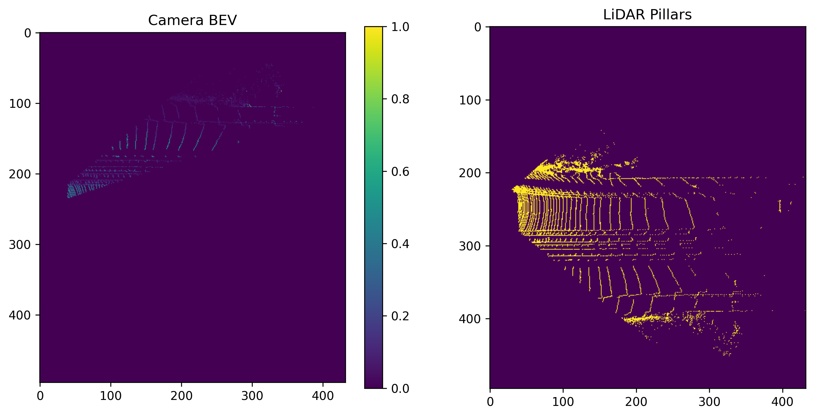

# KITTI BEV Projection with Sparse Depth and Image Features

This project demonstrates how to project LiDAR point clouds from the KITTI dataset into the image plane, extract sparse depth maps, and transform both LiDAR and image data into a Bird's Eye View (BEV) representation. It includes a PyTorch-compatible `Dataset` class and a full data loading pipeline, ready to be fed into deep learning models for 3D object detection or sensor fusion tasks.

## 📸 RGB Image to BEV Projection

Below is a sample output of the BEV projection alongside the corresponding RGB image:

> The BEV view aggregates LiDAR points and RGB image features in a top-down view, providing a spatial representation useful for downstream perception models.

---

## 🧠 Features

- Loads KITTI point cloud and image data
- Uses KITTI calibration matrices to:
  - Project LiDAR points to the image plane
  - Generate sparse depth maps
  - Extract image features for LiDAR points
- Projects data into a BEV raster grid
- Filters and augments 3D bounding box labels
- Returns fully structured samples including:
  - BEV image
  - 3D bounding boxes
  - Class labels

